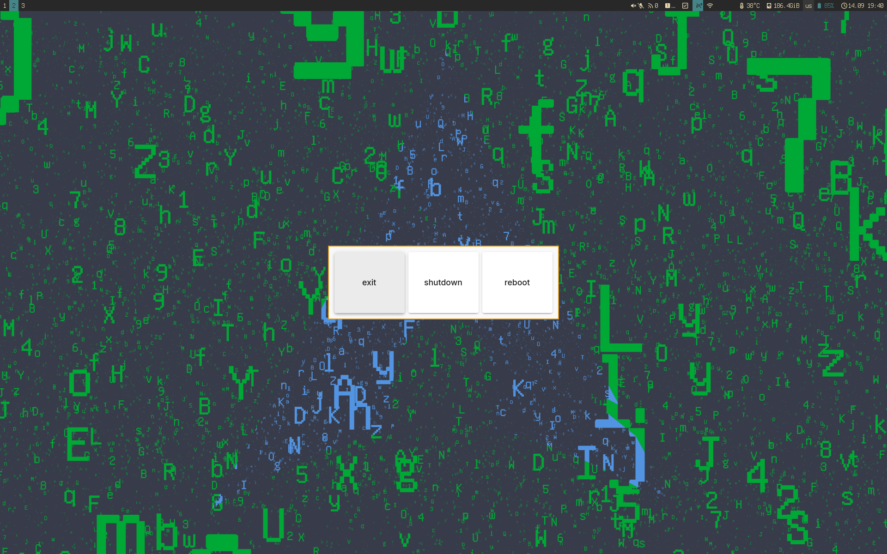
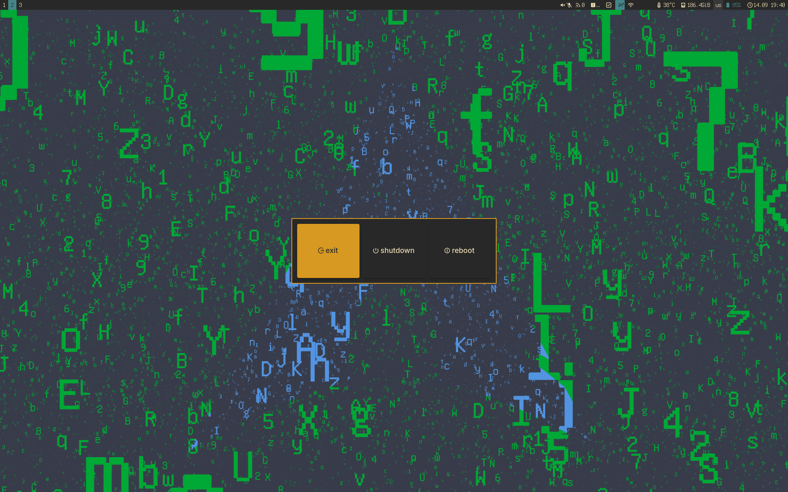

# ByeByeMenu

A minimal, customizable power menu for Wayland compositors (such as [niri](https://github.com/YaLTeR/niri)). Written in Rust with GTK4.

ByeByeMenu displays up to six configurable buttons for custom actions. By default, the first three buttons allow you to log out, shut down, or reboot. Custom styling can be supplied via a CSS file.

## Usage

Run `byebyemenu` from your launcher, terminal, or bind it to a key in your compositor configuration.

### Navigation

ByeByeMenu uses GTK mnemonics to support custom key bindings for each button. **GTK mnemonics** are keyboard shortcuts that let you activate buttons by pressing `Alt` plus a highlighted letter.

You can also navigate the menu using the `Tab` and `Shift+Tab` keys to cycle focus between buttons, or simply click with the mouse.

Press `Esc` at any time to dismiss the menu.

#### How mnemonics work

- In GTK, a mnemonic is set by placing an underscore (`_`) before a character in a button's label (e.g., `_shutdown`).
- When the menu is open, press and hold `Alt` to see which letters are underlined — these are the mnemonics.
- While holding `Alt`, press the underlined letter to immediately activate the corresponding button.
- For example, if a button is labeled `_reboot`, you can press `Alt+R` to trigger it.

#### Customizing mnemonics

Set mnemonics for each button by adding an underscore in the `BBMENU_ACTION{N}_LABEL` environment variable. For example:

```sh
export BBMENU_ACTION1_LABEL="e_xit"
export BBMENU_ACTION2_LABEL="shut_down"
export BBMENU_ACTION3_LABEL="_reboot"
```

## Installation

### Build from source

```sh
git clone https://github.com/t4k1t/byebyemenu.git
cd byebyemenu
cargo build --release
```

The resulting binary will be in `target/release/byebyemenu`.

## Configuration

Currently, ByeByeMenu is configured via environment variables.

### Actions

Each button is configured with:

- `BBMENU_ACTION{N}_CMD` — Command to run (parsed like a shell command)
- `BBMENU_ACTION{N}_LABEL` — Button label (underscores for mnemonics)

Example (for 3 buttons):

```sh
export BBMENU_ACTION1_CMD="loginctl terminate-user $USER"
export BBMENU_ACTION1_LABEL="_exit"
export BBMENU_ACTION2_CMD="systemctl poweroff"
export BBMENU_ACTION2_LABEL="_shutdown"
export BBMENU_ACTION3_CMD="systemctl reboot"
export BBMENU_ACTION3_LABEL="_reboot"
```

Buttons 4–6 are optional and hidden unless both CMD and LABEL are set. No more than six buttons may be configured.

### CSS Styling

- `BBMENU_CSS_PATH` — Path to a custom GTK CSS file.
  - Defaults to `$XDG_CONFIG_HOME/byebyemenu/style.css` or `$HOME/.config/byebyemenu/style.css`.
  - If missing or invalid, a built-in theme is used.

## Screenshots

The default theme sets the font size, padding, and margins. Here is what it looks like with the `Materia` GTK theme:



Here is another example with a custom [`gruvbox-dark`](examples/css/gruvbox-dark.css) theme:



The screenshot above includes icons. You can achieve this by using Unicode icons in the `BBMENU_ACTION{N}_LABEL` environment variables. For example:

```sh
BBMENU_ACTION1_LABEL='󰿅  _exit' BBMENU_ACTION2_LABEL='󰤆  _shutdown' BBMENU_ACTION3_LABEL='󰤁  _reboot'
```

### Logging

- `RUST_LOG` — Set log level (e.g. `info`, `warn`, `debug`).

## License

ByeByeMenu is distributed under the terms of the [MIT](https://spdx.org/licenses/MIT.html) license.

## Roadmap

▶️ **v0.2.0**
- [x] Allow customization of all six buttons
- [x] Improve command parsing
 
🐌 **v0.3.0** - First public release
- [x] Unit tests
- [x] Documentation

🦥 **v0.4.0**
- [x] Publish on crates.io
- [x] Add man pages

🐢 **v0.5.0**
- [ ] TOML config
- [ ] Add optional confirmation dialog
- [ ] Implement custom key bindings
